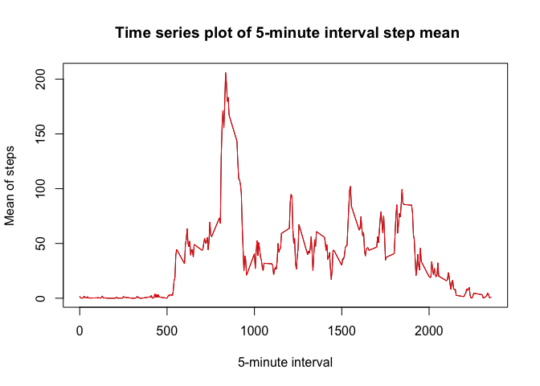

# Reproducible Research: Peer Assessment 1
Massimiliano Grassi  

##Introduction

It is now possible to collect a large amount of data about personal movement using activity monitoring devices such as a Fitbit, Nike Fuelband, or Jawbone Up. These type of devices are part of the “quantified self” movement – a group of enthusiasts who take measurements about themselves regularly to improve their health, to find patterns in their behavior, or because they are tech geeks. But these data remain under-utilized both because the raw data are hard to obtain and there is a lack of statistical methods and software for processing and interpreting the data.

This assignment makes use of data from a personal activity monitoring device. This device collects data at 5 minute intervals through out the day. The data consists of two months of data from an anonymous individual collected during the months of October and November, 2012 and include the number of steps taken in 5 minute intervals each day.

## Loading and preprocessing the data

### Loading the data

```r
data <- as.data.frame(read.csv("./activity.csv", header = TRUE, na.strings="NA"))
```
### Preprocessing the data

Convert the "date" variable to date type


```r
data$date <- as.Date(data$date, format="%Y-%m-%d")
```

Create a new dataset without missing values:


```r
data_without_na <- data[!is.na(data$step),]
```

## What is mean total number of steps taken per day?

Calculate the total number of steps taken per day


```r
library(dplyr)
```

```
## 
## Attaching package: 'dplyr'
## 
## The following object is masked from 'package:stats':
## 
##     filter
## 
## The following objects are masked from 'package:base':
## 
##     intersect, setdiff, setequal, union
```


```r
steps_per_day  <- data_without_na %>% group_by(date) %>% summarize(sum(steps))
names(steps_per_day)  <- c('date', 'steps')
```

Make a histogram of the total number of steps taken each day 


```r
hist(steps_per_day$steps, main="Histogram of total steps by day", xlab="Number of steps by day", ylab="Number of steps", col="red")
```

 

Save the histogram into '/figures/' as 'plot1.png'


```r
png(filename='figures/plot1.png', width=480, height=480, units="px")
hist(steps_per_day$steps, main="Histogram of Total steps by day", xlab="Number of steps by day", ylab="Number of steps", col="red")
dev.off()
```

```
## quartz_off_screen 
##                 2
```

Calculate and report the mean and median of the total number of steps taken per day


```r
mean(steps_per_day$steps) 
```

```
## [1] 10766.19
```

```r
median(steps_per_day$steps) 
```

```
## [1] 10765
```

## What is the average daily activity pattern?

Make a time series plot of the 5-minute interval and the average number of steps taken, averaged across all days 


```r
daily_pattern  <- data_without_na %>% group_by(interval) %>% summarize(mean(steps))
names(daily_pattern)  <- c('interval', 'steps')
plot(daily_pattern$interval, daily_pattern$steps, type="l", main=" Time series plot of 5-minute interval step mean", xlab="5-minute interval", ylab="Mean of steps")
lines(daily_pattern$interval, daily_pattern$steps, type="l", col="red")
```

 

Save the time series plot into '/figures/' as 'plot2.png'


```r
png(filename='figures/plot2.png', width=480, height=480, units="px")
plot(daily_pattern$interval, daily_pattern$steps, type="l", main=" Time series plot of 5minute interval step mean", xlab="5-minute interval", ylab="Mean of steps")
lines(daily_pattern$interval, daily_pattern$steps, type="l", col="red")
dev.off()
```

```
## quartz_off_screen 
##                 2
```

Calculate the 5-minute interval, on average across all the days in the dataset, that contains the maximum number of steps 


```r
max  <- max(daily_pattern$steps)
daily_pattern$interval[daily_pattern$steps == max]
```

```
## [1] 835
```

## Imputing missing values

Calculate and report the total number of missing values in the dataset (i.e. the total number of rows with NAs)

```r
sum(is.na(data$steps))
```

```
## [1] 2304
```

Substituting all missing values in the dataset with the mean for that 5-minute interval in the other days


```r
data_na_substituted  <- data
for (i in 1:nrow(data)) {
        if (is.na(data_na_substituted[i,1])) {
                interval_sub <- data[i,3]
                data_na_substituted[i,1] <- daily_pattern[daily_pattern$interval == interval_sub,2]
        }
}
```

Make a histogram of the total number of steps taken each day (now with missing values substituted)


```r
steps_per_day_na_substituted  <- data_na_substituted %>% group_by(date) %>% summarize(sum(steps))
names(steps_per_day_na_substituted)  <- c('date', 'steps')
hist(steps_per_day_na_substituted$steps, main="Histogram of Total steps by day", xlab="Number of steps by day", ylab="Number of steps", col="red")
```

 

Save the histogram into '/figures/' as 'plot3.png'


```r
png(filename='figures/plot3.png', width=480, height=480, units="px")
hist(steps_per_day_na_substituted$steps, main="Histogram of Total steps by day", xlab="Number of steps by day", ylab="Number of steps", col="red")
dev.off()
```

```
## quartz_off_screen 
##                 2
```

Calculate and report the mean and median of the total number of steps taken per day


```r
mean(steps_per_day_na_substituted$steps) 
```

```
## [1] 10766.19
```

```r
median(steps_per_day_na_substituted$steps) 
```

```
## [1] 10766.19
```

```r
mean_change  <- (mean(steps_per_day_na_substituted$steps)-mean(steps_per_day$steps))
median_change  <- (median(steps_per_day_na_substituted$steps)-median(steps_per_day$steps))
```

Sustituting the missing values in the data makes, the mean changed of 0 and the median changed of 1.1886792

## Are there differences in activity patterns between weekdays and weekends?

Create a new factor variable in the dataset with two levels – “weekday” and “weekend” indicating whether a given date is a weekday or weekend day.


```r
data_na_substituted_weekpart  <- mutate(data_na_substituted, weekpart = weekdays(data_na_substituted$date))
for (i in 1:nrow(data_na_substituted_weekpart)) {
    if ((data_na_substituted_weekpart[i,4] == 'Sabato') | (data_na_substituted_weekpart[i,4] == 'Domenica')){
       data_na_substituted_weekpart[i,4]  <- 'weekend'                
    }
    else {data_na_substituted_weekpart[i,4]  <- 'weekday'}
}
data_na_substituted_weekpart$weekpart  <- as.factor(data_na_substituted_weekpart$weekpart)
```

Make a panel plot containing a time series plot of the 5-minute interval and the average number of steps taken, averaged across all weekday days or weekend days


```r
steps_per_day_na_substituted_weekpart  <- data_na_substituted_weekpart %>% group_by(date, weekpart) %>% summarize(sum(steps))
names(steps_per_day_na_substituted_weekpart)  <- c('date', 'weekpart', 'steps')
daily_pattern_weekpart  <- data_na_substituted_weekpart %>% group_by(interval, weekpart) %>% summarize(mean(steps))
names(daily_pattern_weekpart)  <- c('interval', 'weekpart', 'steps')

library(lattice) 
xyplot(daily_pattern_weekpart$steps ~ daily_pattern_weekpart$interval | daily_pattern_weekpart$weekpart, 
       layout=c(1,2), 
       type="l",
       xlab = "Interval",
       ylab = "Number of steps")
```

 

Save the panel plot into '/figures/' as 'plot4.png'


```r
png(filename='figures/plot4.png', width=480, height=480, units="px")
xyplot(daily_pattern_weekpart$steps ~ daily_pattern_weekpart$interval | daily_pattern_weekpart$weekpart, 
       layout=c(1,2), 
       type="l",
       xlab = "Interval",
       ylab = "Number of steps")
dev.off()
```

```
## quartz_off_screen 
##                 2
```
